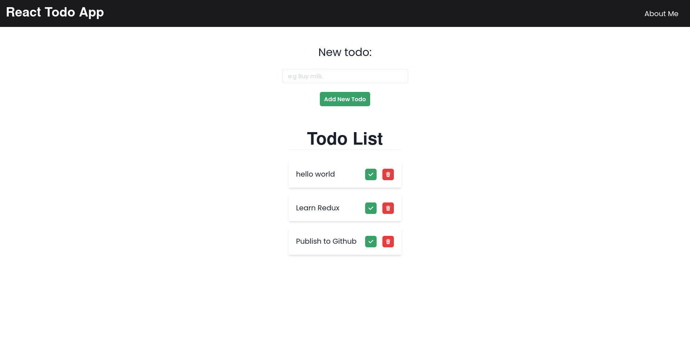

# React Todo App

I created this app using Chakra UI for styling, React for frontend, Express to create the API and UUID to generate ids for the json database.

It is as you would expect a simple todo app, but I have learned a lot from it.



## Requirements

- NodeJs installed

## Install on your machine

Run:

``` bash
git clone git@github.com:R0L3eX9/react-todo.git
cd react-todo
npm install
npm start
```

## What I learned?

- How to use, useContext React Hook
- Learned about Chakra UI
- How to create a simpe API
- How to use a json file as a project database
